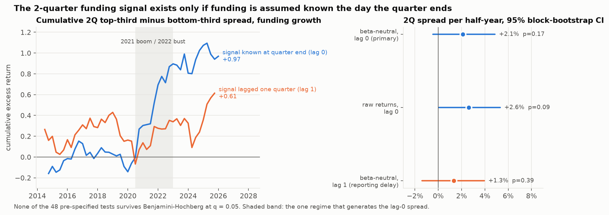

# Private Signals

**Does private-market (VC / growth-equity) funding activity in a sector lead
public-market returns for that sector?**

A small, reproducible study built to be argued with. Every experiment has a
protocol, a confidence interval, a permutation p-value, a multiple-testing
correction, and a verdict, recorded in [`ledger.md`](ledger.md).

## In one look



Sort the ten sectors each quarter by funding growth, go long the top third and
short the bottom third, hold two quarters, and you appear to earn about 2% per
half-year beta-neutral. Lag the funding data by one quarter, which is what a
real investor has to do because PitchBook back-fills deals for weeks after they
close, and the spread falls to 1.3% with a p-value of 0.39. The lag-0 spread
is also generated almost entirely by the 2021 venture boom and 2022 bust. The
study's answer is no; the useful part is the demonstration of how a plausible
alternative-data signal is a look-ahead artifact, caught by a pre-registered
check rather than by hindsight.

> **Status: complete.** The committed ledger and figures are from the real
> run on PitchBook data (US VC and growth deals, 2014Q1 to 2026Q2, exported
> 6 Oct 2026). The licensed inputs themselves are never committed; see
> [Data policy](#data-policy) for how to reproduce them.

## Question, made precise

For sector *s* and quarter *t*, let `funding_growth_qoq` be the change in log
total VC/growth funding from *t-1* to *t*. Let `fwd_hq` be the return of the
sector's ETF from the last trading day of *t* to the last trading day of *t+h*,
for *h* in {1, 2, 4} quarters, after removing beta times the SPY return
(beta estimated on trailing daily returns ending at *t*, so no look-ahead).

The hypothesis "private funding leads public returns" predicts that sectors
whose funding grew fastest in *t* out-perform, beta-neutral, over the next
*h* quarters. Two secondary features test the same idea with different
inputs: `deal_growth_qoq` (log deal count) and `funding_growth_yoy`.

## Design

| piece | choice | why |
|---|---|---|
| Public side | 10 sector ETFs + SPY, daily adjusted closes via yfinance, 2014 onward | liquid, investable proxies for sector returns |
| Private side | PitchBook: completed US early-stage VC, later-stage VC and PE growth deals, pivoted to sector x quarter (deal count, capital invested, median post-money valuation) | the standard source; four pivot exports, converted by `scripts/convert_pitchbook_pivot.py` |
| Sector map | `private_signals/sectors.py` | PitchBook verticals do not map 1:1 to ETFs; the mapping is explicit so it can be challenged |
| Returns | raw, beta-neutral excess (default), or vol-adjusted | isolates sector-specific return from the market factor |
| Timing | signal at end of quarter *t*, return from end of *t* (+ optional lag) | `--lag 1` is the robustness check for PitchBook's reporting delay |

### Experiments

1. **Cross-sectional tercile sorts** (`S01-S09`). Each quarter, rank sectors by
   the feature, take the top third minus the bottom third of forward returns,
   and average the spread over quarters. CI: paired-by-quarter circular
   **block bootstrap** with block length = horizon, because 2Q and 4Q forward
   windows overlap for consecutive quarters. p: permutation of returns
   *within* quarter, which preserves quarter-level common shocks.
2. **Pooled Spearman rank correlations** (`P01-P09`) between the feature and
   the forward return over all sector-quarters. CI: cluster bootstrap over
   quarters. p: within-quarter permutation.
3. **Per-sector time-series rank correlations** (`B-*`) for the primary
   feature, 10 sectors x 3 horizons. Decision statistic is the BH-adjusted p.
4. **Walk-forward** (`W01-W03`): expanding-window splits of the sort spread
   series; does the in-sample sign persist out of sample? Descriptive only.

Multiple testing: **Benjamini-Hochberg at q = 0.05 within each family**
(sorts: 9 tests; pooled: 9; per-sector: 30). Robustness re-runs with other
return modes or lags are variations of the same hypothesis and are kept out
of the families so the correction is not made to look stricter than it is.

All statistics utilities (`private_signals/stats.py`) are implemented from
scratch with standard methodology: percentile bootstrap (i.i.d., paired,
cluster, circular block), permutation tests, BH step-up, walk-forward splits.
Every randomised routine takes a seed (default 0). 10,000 bootstrap resamples
and 5,000 permutations per test; a full run takes about a minute.

## Findings

**The answer is no, and the interesting part is why it briefly looked like yes.**
Across 48 pre-specified tests, none survives Benjamini-Hochberg correction at
q = 0.05 within its family. The data do not support the claim that a sector's
private funding growth leads its public, beta-neutral ETF return at 1, 2 or 4
quarters. Full detail, including every CI and p-value, is in
[`ledger.md`](ledger.md).

What the data do show, stated at the strength the evidence supports:

* **A weak, positive, non-robust lead at the 2-quarter horizon.** The pooled
  Spearman correlation between quarter-over-quarter funding growth and the
  next two quarters' excess return is +0.09 (cluster-bootstrap 95% CI
  +0.005 to +0.18, permutation p = 0.03, BH-adjusted p = 0.14). The matching
  tercile sort earns +2.1% per two quarters (CI -0.5% to +4.9%, p = 0.17),
  and its sign held in all four walk-forward test folds. Deal-count growth
  tells the same story at 2Q (p = 0.013, BH p = 0.12).
* **It does not survive the reporting-delay check.** Lagging the signal by one
  quarter, which is the realistic assumption given how PitchBook back-fills
  deals, cuts the 2Q sort spread to +1.3% (p = 0.39) and the pooled
  correlation to +0.04 (p = 0.33). A signal that only works when funding is
  assumed known the day the quarter ends is not a tradeable lead.
* **It is a post-2020 phenomenon.** The cumulative 2Q spread is flat from
  2014 to mid-2020 and accumulates almost entirely during the 2021 venture
  boom and 2022 bust, when sector ETFs with heavy private-market exposure
  (software, fintech, biotech) moved together with funding. One regime is not
  a pattern.
* **Per-sector series show nothing.** Thirty sector x horizon rank
  correlations, none with BH p below 0.55. The largest, technology at 4Q,
  is negative (rho -0.36, nominal p = 0.018), the opposite sign from the
  hypothesis.

Robustness variants (same 48 tests each, ledgers under `results/robustness/`):

| variant | 2Q sort spread | 2Q pooled rho (p) | tests surviving BH |
|---|---|---|---|
| beta-neutral excess returns, lag 0 (primary) | +2.1% [-0.5, +4.9] | +0.09 (0.03) | 0 / 48 |
| raw returns, lag 0 | +2.6% [+0.05, +5.3] | +0.09 (0.02) | 0 / 48 |
| vol-adjusted excess, lag 0 | +0.06 sigma [-0.09, +0.21] | +0.08 (0.06) | 0 / 48 |
| beta-neutral excess, **lag 1** | +1.3% [-1.4, +3.9] | +0.04 (0.33) | 0 / 48 |

The pre-registered reading rule was: a result counts only if its 95% CI
excludes zero **and** its BH-adjusted p is at or below 0.05 **and** the
walk-forward sign agrees in a majority of folds. Nothing meets it. The
closest candidate (pooled 2Q) passes the first and third conditions, fails
the second, and fails the lag-1 robustness check. The verdict is a null
result with one lead worth re-testing when more post-2022 quarters exist.

Why a null is still informative here: private and public markets price the
same sectors, so a strong lead would imply public markets ignore widely
reported funding data for months. The data are consistent with public
markets incorporating that information within the quarter it arrives.

Figures (`figures/`): `headline.png` (the lag-0 versus lag-1 comparison above),
`sort_spreads.png` (spread with CI per feature and horizon),
`cumulative_spread_{1,2,4}q.png` (cumulative spread with walk-forward folds),
`sector_rank_corr_heatmap.png`, `bh_pvalues.png` (sorted p-values against the
BH line, per family).

## Data policy

* **PitchBook data is never committed.** `data/` is git-ignored from the first
  commit; only `data/README.md` and the synthetic fixture are tracked. Every
  derived `panel.csv` is git-ignored too, since it carries PitchBook-derived
  features. What is committed is aggregate statistics only (ledgers, summary
  tables, figures).
* `data/README.md` documents the exact screener criteria and pivot settings
  used, and the columns the loader expects, so anyone with their own PitchBook
  access (for example through a university library) can rebuild the inputs in
  about ten minutes.
* `data/synthetic_fixture.csv` is **FAKE**: a seeded AR(1) process in logs with
  no relationship to real funding or returns. Its first line says so, the
  loader detects the marker, and every downstream artifact is watermarked
  `SYNTHETIC`.
* Market data comes from Yahoo Finance through `yfinance` and is cached under
  `cache/` (git-ignored).

## Reproduce

```bash
python3 -m venv .venv && .venv/bin/pip install -r requirements.txt
.venv/bin/python -m pytest -q                          # 36 tests
.venv/bin/python scripts/convert_pitchbook_pivot.py    # data/raw/*.xlsx -> data/pitchbook_export.csv
.venv/bin/python scripts/run_experiments.py            # falls back to the synthetic fixture if no export
.venv/bin/python scripts/run_experiments.py --mode raw --lag 1   # robustness variant
```

Outputs: `ledger.md`, `results/summary.csv`, `results/run_meta.json`, `figures/*.png`.

## Known limitations

* Ten sectors is a thin cross-section; terciles are three sectors each.
  Cross-sectional power is low by construction, which is why the ledger leans
  on CIs rather than on p-values alone.
* The ten funding series overlap (software sits inside technology, biotech
  inside healthcare, fintech straddles two sectors, and PitchBook verticals
  are multi-valued tags). Overlap makes sectors look more alike and works
  against finding a spread, so it biases toward the null rather than away.
* Capital invested sums only the deals with a disclosed size (about 70% of
  deals). Deal count, which has no such gap, gives the same picture.
* The sample covers one full venture cycle (2014 to 2026). Twelve years of
  quarterly data is 47 to 50 observations per sector.
* Per-sector time-series p-values use an unrestricted permutation that ignores
  the serial dependence induced by overlapping 2Q and 4Q windows. That bias is
  against the null, so a null there is conservative and a rejection is not.
* ETF inception dates (HACK late 2014, FINX late 2016) shorten the early
  cross-section.
* The sector-to-ETF mapping is a judgment call. It is isolated in one file so
  it can be varied.

## Layout

```
private_signals/
  sectors.py      sector -> ETF mapping
  loader.py       PitchBook CSV loader, synthetic detection, cached prices
  panel.py        forward returns (raw / excess / vol-adjusted), funding features, panel join
  stats.py        bootstrap, permutation, Benjamini-Hochberg, walk-forward (from scratch)
  experiments.py  the four experiments and verdict rules
  ledger.py       renders ledger.md
  figures.py      matplotlib figures
scripts/
  run_experiments.py, convert_pitchbook_pivot.py, make_headline_figure.py,
  make_synthetic_fixture.py
tests/            pytest suites for stats, loader, panel, experiments
```
